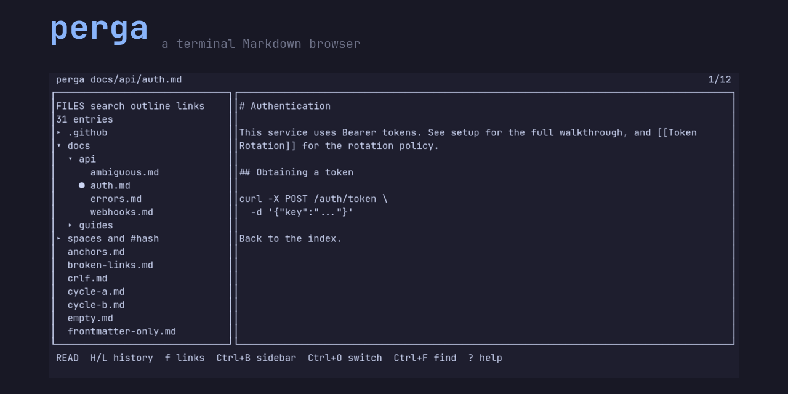

<!--
  This is the social preview, standing in until the demo GIF is recorded:
  `cd demo && vhs demo.tape`, then replace the line below with

      

  See demo/README.md.
-->


# perga

A terminal Markdown browser: a full-screen TUI that opens a directory of
Markdown files and lets you navigate, read, search, and edit them with the
ergonomics of a document browser rather than a pager.

A persistent hierarchical sidebar, a document viewport with tabs, browser-like
back/forward history per tab, wiki-links with backlinks, and in-place editing —
in one static binary with no runtime dependencies.

## Name origin

Parchment takes its name from Pergamon, the ancient city in western Anatolia
where, according to Pliny, animal-skin writing surfaces were developed after
Egypt restricted papyrus exports. The Latin *pergamena* and, through it, the
English *parchment* both descend from the city's name. `perga` is named after
the root of the written page.

## What it is for

A vault of Markdown files — notes, a documentation tree, a wiki — read and
edited in the terminal, with the directory structure kept in front of you and
links between documents that actually go somewhere.

| | What it does | What perga adds |
|---|---|---|
| [`glow`](https://github.com/charmbracelet/glow) | Finds Markdown files recursively, lists them, renders them with Glamour | A hierarchical tree kept on screen while you read, link navigation between documents, per-tab history, and editing |
| [`frogmouth`](https://github.com/Textualize/frogmouth) | Browser-like navigation, history, bookmarks, a table of contents | A persistent file tree, wiki-links and backlinks, and a static binary with no interpreter to start |
| [`mdcat`](https://github.com/swsnr/mdcat) | Single-document rendering, with inline images on capable terminals | An interactive browser rather than a one-shot renderer — though `perga --print` covers that case too |
| [`bat`](https://github.com/sharkdp/bat) | Syntax-highlighted paging for any file, Markdown included | Rendered Markdown rather than highlighted source, plus everything above |

All four are good at what they do, and `mdcat` in particular renders a single
document better than perga does on a terminal that can draw images. The
combination perga is for is the sidebar, the links, and the editing together.

## Platform

Linux, `x86_64` and `aarch64`. The release binaries are statically linked
against musl, so they run on distributions far older than the one they were
built on.

## Installation

### From a release

```sh
v=0.1.0
arch=$(uname -m)                                    # x86_64 or aarch64
base=https://github.com/ankasoft/perga/releases/download/v$v
curl -sSL "$base/perga-$arch-unknown-linux-musl.tar.xz" | tar xJ --strip-components=1
sudo install -m755 perga /usr/local/bin/perga
```

The tarball also holds the man page, the shell completions, and both licence
files. See [docs/publishing.md](docs/publishing.md) for what is in it.

### With the installer script

```sh
curl -sSfL https://github.com/ankasoft/perga/releases/latest/download/perga-installer.sh | sh
```

### Arch Linux

```sh
paru -S perga-bin      # or yay, or your helper of choice
```

### From crates.io

```sh
cargo install perga
```

### From source

```sh
git clone https://github.com/ankasoft/perga
cd perga
cargo install --path .
```

### Debian and RPM

Built from this repository's metadata rather than published; see
[packaging/README.md](packaging/README.md).

## Quick start

```sh
perga            # open the current directory
perga docs/      # open a directory as the vault root
perga README.md  # open a file, with its parent directory as the vault root
```

Press `?` for the full keybinding reference. `q` quits.

```sh
perga --print README.md      # render to stdout and exit
perga README.md | less -R    # the same, because stdout is not a terminal
```

## Keys worth knowing first

| Key | |
|---|---|
| `?` | Every binding, generated from the keymap so it cannot be out of date |
| `Tab` | Move focus between the sidebar and the document |
| `j` `k`, `Ctrl+D` `Ctrl+U`, `g g` `G` | Scroll |
| `n` `N`, `Enter` | Step through links, follow one |
| `f` | Label every visible link and jump by typing its label |
| `H` `L` | Back and forward, restoring where you were |
| `Ctrl+O` | Fuzzy file switcher |
| `Ctrl+G` | Search the whole vault |
| `Ctrl+F` | Find in this document |
| `m 1` … `m 4` | Sidebar mode: files, search, outline, links |
| `e` | Edit. `Ctrl+S` saves, `Esc` leaves |
| `Ctrl+N` | New file |

Full reference: [docs/keybindings.md](docs/keybindings.md).

### A note for tmux users

`Ctrl+B` toggles the sidebar, and it is also the default tmux prefix — tmux
consumes it before perga sees it. `Ctrl+E` is bound to the same action and is
always available.

## Documentation

- [Usage](docs/usage.md) — the whole interface, feature by feature
- [Configuration](docs/configuration.md) — every key, with its default
- [Keybindings](docs/keybindings.md) — every binding, and how to remap it
- [Theming](docs/theming.md) — writing a theme, and every style key
- [Architecture](docs/architecture.md) — how it is put together
- [Publishing](docs/publishing.md) — how a release is cut
- [Licensing](docs/licensing.md) — what the licence means for you
- [Decisions](docs/decisions.md) — why things are the way they are

## Contributing

See [CONTRIBUTING.md](CONTRIBUTING.md). In short: `cargo fmt`, `cargo clippy
--all-targets -- -D warnings`, `cargo test`, conventional commit messages, and
one logical change per commit.

## License

Licensed under either of

- Apache License, Version 2.0 ([LICENSE-APACHE](LICENSE-APACHE))
- MIT license ([LICENSE-MIT](LICENSE-MIT))

at your option.

### Contribution

Unless you explicitly state otherwise, any contribution intentionally submitted
for inclusion in the work by you, as defined in the Apache-2.0 license, shall be
dual licensed as above, without any additional terms or conditions.
